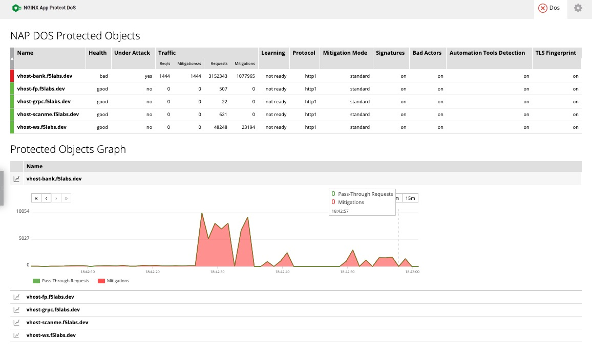
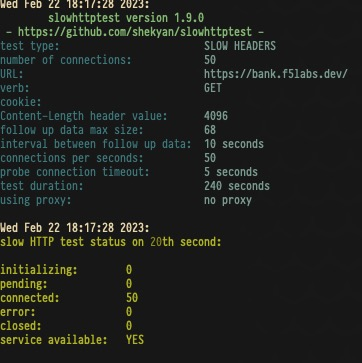
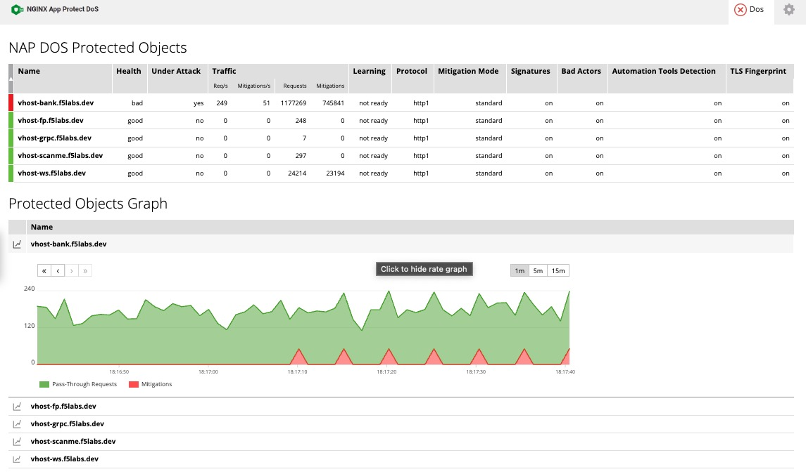

[](https://api.securityscorecards.dev/projects/github.com/apcj-f5/nap-dos-demo)

# Demonstrating L7 DoS capabilities of NGINX App Protect

<br>

**Maintainer:**   &emsp; **Contributor:** 


<br>

This repository contains the necessary files for creating NGINX App Protect DoS configuration
for protection of HTTP, gRPC and Websockets.

- [HTTP endpoint @ https://bank.f5labs.dev](https://bank.f5labs.dev)
- [gRPC endpoint @ https://grpc.f5labs.dev](https://grpc.f5labs.dev)
- [Websockets endpoint @ wss://ws.f5labs.dev](https://ws.f5labs.dev)

Baseline and performance tests are performed with [k6](https://k6.io)

To run a test:

1. start a test from one of the following [baseline test files](k6/baseline)
2. on a separate host (not the same one as baseline is running from) run a test from one of the following [load test files](k6/load)

Monitoring logs on the host where NGINX App Protect DoS is installed should show something similar to the following while under load:

```bash

root@bank.f5labs.dev# tail -f /var/log/adm/admd.log

ADMD.Daemon0 Feb 22 03:23:02 [info] : attack started on vs<vhost-bank.f5labs.dev>, profile<vhost-bank.f5labs.dev_prof_0>, attack_id<22>, is_under_attack=<1>, arb_declared_attack<0>, health<1.50>, global_conn<10>, L7 Drop ratio=0.00000
ADMD.Daemon0 Feb 22 03:25:26 [info] : attack ended on vs<vhost-bank.f5labs.dev> profile<vhost-bank.f5labs.dev_prof_0>, m_time_without_attack<0>

```

Once the baseline test is finished it should report details such as the following (showing whether traffic was affected during the load generation):

```bash

root@user.f5labs.dev# k6 run k6/baseline/http-baseline-test.js

          /\      |‾‾| /‾‾/   /‾‾/
     /\  /  \     |  |/  /   /  /
    /  \/    \    |     (   /   ‾‾\
   /          \   |  |\  \ |  (‾)  |
  / __________ \  |__| \__\ \_____/ .io

  execution: local
     script: k6/baseline/http-baseline-test.js
     output: engine

  scenarios: (100.00%) 1 scenario, 1 max VUs, 2m0s max duration (incl. graceful stop):
           * default: Up to 1 looping VUs for 1m30s over 3 stages (gracefulRampDown: 30s, gracefulStop: 30s)


     data_received..................: 2.3 MB 26 kB/s
     data_sent......................: 23 kB  255 B/s
     http_req_blocked...............: avg=7.67ms   min=0s       med=1µs      max=2.43s    p(90)=2µs      p(95)=2µs
     http_req_connecting............: avg=358.35µs min=0s       med=0s       max=113.6ms  p(90)=0s       p(95)=0s
   ✓ http_req_duration..............: avg=276.18ms min=117.01ms med=279.68ms max=1.59s    p(90)=326.93ms p(95)=388.69ms
       { expected_response:true }...: avg=276.18ms min=117.01ms med=279.68ms max=1.59s    p(90)=326.93ms p(95)=388.69ms
   ✓ http_req_failed................: 0.00%  ✓ 0        ✗ 317
     http_req_receiving.............: avg=751.48µs min=60µs     med=204µs    max=99.39ms  p(90)=611.6µs  p(95)=1.42ms
     http_req_sending...............: avg=187.09µs min=21µs     med=80µs     max=8.53ms   p(90)=318.8µs  p(95)=475.79µs
     http_req_tls_handshaking.......: avg=468.25µs min=0s       med=0s       max=148.43ms p(90)=0s       p(95)=0s
     http_req_waiting...............: avg=275.24ms min=116.7ms  med=278.49ms max=1.59s    p(90)=326.67ms p(95)=388.53ms
     http_reqs......................: 317    3.518063/s
     iteration_duration.............: avg=284.19ms min=117.15ms med=280.37ms max=2.66s    p(90)=330.48ms p(95)=391.36ms
     iterations.....................: 317    3.518063/s
     vus............................: 1      min=1      max=1
     vus_max........................: 1      min=1      max=1


running (1m30.1s), 0/1 VUs, 317 complete and 0 interrupted iterations
default ✓ [======================================] 0/1 VUs  1m30s


```

NGINX App Protect DoS Dashboard will look something like the following under a load test:



Tests can also be run with 'slow HTTP DoS' with the following commands:

```bash

root@attacker.f5labs.dev$ slowhttptest -u https://bank.f5labs.dev

```



Output like the following during a 'slow HTTP DoS' will be seen in the NGINX App Protect Dashboard:


